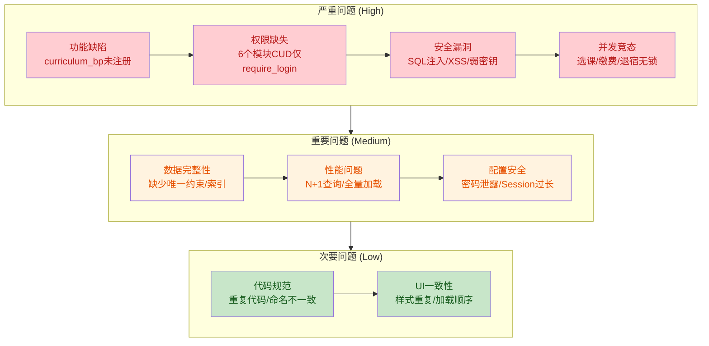

# SIMS 学生信息管理系统 - 全面代码质量审查报告

> 审查日期：2026-06-18
> 项目技术栈：Flask 2.x + SQLAlchemy 2.0 + PostgreSQL
> 架构模式：MVC 分层（Controller / Service / Repository / Entity）
> 审查范围：21 个 Controller、24 个 Service、20 个 Entity、20 个 Repository、28 个前端模板、Middleware、Utils、Config

---

## 项目架构概览

---

## 统计摘要

| 严重程度 | 数量 | 占比 |
|---------|------|------|
| **高** | 32 | 24% |
| **中** | 82 | 61% |
| **低** | 20 | 15% |
| **总计** | **134** | 100% |

### 按问题类别分布

| 类别 | 高 | 中 | 低 | 小计 |
|------|---|---|---|------|
| 功能完整性 | 5 | 12 | 1 | 18 |
| 逻辑错误 | 4 | 14 | 2 | 20 |
| 安全漏洞 | 11 | 9 | 0 | 20 |
| 界面一致性 | 1 | 5 | 5 | 11 |
| 性能/兼容性 | 0 | 13 | 0 | 13 |
| 数据模型(索引/约束) | 0 | 18 | 4 | 22 |
| 权限控制 | 7 | 2 | 0 | 9 |
| 代码规范 | 0 | 5 | 8 | 13 |
| 其他 | 4 | 2 | 0 | 6 |

### 最需优先修复的 Top 10

1. **curriculum_bp 未注册** — 整个培养计划模块不可用
2. **SQL 注入** — comprehensive_query_service 用户输入直接拼入 SQL
3. **6 个模块 CUD 缺少 @require_admin** — 任何登录用户可增删改核心数据
4. **选课容量竞态条件** — 并发选课可超额
5. **XSS 漏洞** — 多处 innerHTML 未转义 API 数据
6. **硬编码弱 SECRET_KEY** — 可伪造 session cookie
7. **6 个更新接口缺少字段白名单** — 可注入任意字段
8. **选课接口可替他人选课** — 权限越权
9. **缴费/退宿并发无锁** — 金额/计数可出错
10. **bcrypt 回退到弱 SHA-256** — 密码安全性严重降级

---

## 一、功能完整性检查

| No. | 问题标题 | 严重度 | 代码位置 | 建议解决方案 |
|-----|---------|--------|---------|------------|
| 1 | curriculum_bp 未注册，培养计划模块所有路由不可用 | **高** | `controller/__init__.py#L1-L45` | 添加 `from controller.curriculum_controller import curriculum_bp` 并在 register_all 中注册 |
| 2 | 选课管理页面使用了错误的 API 端点 `/api/grades` 而非 `/api/enrollments` | **高** | `templates/enrollments.html#L97` | 将 API 端点从 `/api/grades` 修改为 `/api/enrollments` |
| 3 | Curriculum 的 relationship back_populates 指向不存在的属性 | **高** | `entity/curriculum.py#L21-L22` | 在 Major 和 Course 实体中添加 curricula 关系属性 |
| 4 | EnrollLog 的 relationship back_populates 指向不存在的属性 | **高** | `entity/enroll_log.py#L21-L22` | 在 Student 和 Teaching 实体中添加 enroll_logs 关系属性 |
| 5 | 注册与修改密码的强度校验不一致（注册>=6位，修改>=8位+复杂度） | 中 | `service/auth_service.py#L105-L106` | 统一密码强度校验标准，register() 也应调用 `_validate_password_strength()` |
| 6 | 注册异常被吞没，无日志记录 | 中 | `service/auth_service.py#L169-L171` | 添加 logging.exception 记录原始异常 |
| 7 | 批量导入用户使用极弱默认密码 '123456' | **高** | `service/batch_import_configs.py#L476` | 使用随机强密码，或要求首次登录强制修改 |
| 8 | 成绩录入缺少范围校验（可录入负数或超过100） | 中 | `service/grade_service.py#L33-L47` | 添加 `0 <= score <= 100` 范围校验 |
| 9 | 批量录入成绩静默跳过无效数据，调用方无法知道哪些失败 | 中 | `service/grade_service.py#L49-L64` | 记录失败条目并返回详细的成功/失败统计 |
| 10 | 创建学生时未校验学号唯一性 | 中 | `service/student_service.py#L82-L109` | 创建前主动查询 student_id 是否已存在 |
| 11 | 更新学生时未校验班级-学院层级关系（create有但update没有） | 中 | `service/student_service.py#L111-L138` | 抽取公共校验方法，create 和 update 统一调用 |
| 12 | 创建用户时未校验用户名唯一性 | 中 | `service/user_service.py#L36-L62` | 创建前主动查询 username 是否已存在 |
| 13 | 更新用户名时未校验唯一性，管理员修改密码无强度校验 | **高** | `service/user_service.py#L64-L80` | 修改用户名前检查唯一性；管理员修改密码也需强度校验 |
| 14 | 重新选课（退课后重选）未检查课程容量 | 中 | `service/enrollment_service.py#L34-L37` | 重新选课也应执行容量检查逻辑 |
| 15 | 时间冲突检测使用精确字符串匹配，无法检测部分重叠 | 中 | `service/enrollment_service.py#L55-L67` | 将 schedule 拆分为结构化数据，实现真正的时段重叠检测 |
| 16 | 删除接口未处理记录不存在的情况 | 中 | 多个控制器 | 删除前检查记录是否存在，不存在返回 404 |
| 17 | 默认管理员密码每次启动都被重置为 'admin' | 中 | `entity/base.py#L244-L269` | 仅首次创建时设置默认密码，已存在的不重置 |
| 18 | 用户名验证规则不一致：set_username.html 与 _header.html 规则冲突 | **高** | `templates/set_username.html#L137-L138` | 统一两处验证规则，确保与后端 API 一致 |

---

## 二、逻辑错误排查

| No. | 问题标题 | 严重度 | 代码位置 | 建议解决方案 |
|-----|---------|--------|---------|------------|
| 1 | 选课接口未校验 student_id 是否为当前用户，可替他人选课 | **高** | `controller/enrollment_controller.py#L35-L47` | 非管理员时校验 `student_id == session['user_ref_id']` |
| 2 | 选课容量检查存在竞态条件，并发选课可超额 | **高** | `service/enrollment_service.py#L40-L52` | 使用 SELECT FOR UPDATE 锁定 Teaching 行 |
| 3 | 缴费金额更新无锁保护，并发缴费可导致金额计算错误 | **高** | `service/payment_service.py#L21-L39` | 使用 SELECT FOR UPDATE 或 SQL 原子更新 |
| 4 | 退宿操作缺少行级锁，并发退宿可导致 occupied 计数错误 | **高** | `service/dorm_service.py#L113-L131` | 在 checkout() 中使用 SELECT FOR UPDATE |
| 5 | 更新已存在记录时未过滤只读字段（主键、创建时间等） | 中 | `service/batch_import_service.py#L130-L132` | 增加 updatable_fields 白名单 |
| 6 | 布尔值解析逻辑有误，无法识别小写 'true' 或 1 | 中 | `controller/semester_controller.py#L67` | 使用 `str(value).lower() in ('true', '1')` |
| 7 | api_set_username / api_change_password 未处理 get_json() 返回 None | 中 | `controller/auth_controller.py#L137-L165` | 使用 `request.get_json(silent=True) or {}` |
| 8 | 成绩筛选 float(value) 未做异常处理 | 中 | `controller/enrollment_controller.py#L106` | 添加 try/except ValueError |
| 9 | student_count 筛选 value 未做类型校验 | 中 | `controller/class_controller.py#L96-L114` | 对数值型字段执行 int() 转换并添加异常处理 |
| 10 | departments.html currentSort 变量未声明即使用，排序功能无效 | 中 | `templates/departments.html#L274` | 在脚本顶部声明 currentSort 并在 loadDepartments 中传递排序参数 |
| 11 | statistics.html switchTab 使用隐式 event 变量，Firefox 严格模式下报错 | 中 | `templates/statistics.html#L130` | 改为 `switchTab(event, 'overview')`，函数签名改为 `function switchTab(e, tabName)` |
| 12 | settings.html loadCurrentConfig 在 CSRF token 获取完成前发送请求 | 中 | `templates/settings.html#L354` | 将 loadCurrentConfig 放在 fetchCsrfToken 回调中执行 |
| 13 | GPA 排名使用简单平均而非学分加权平均 | 中 | `service/statistics_service.py#L117-L145` | 改为 `sum(grade_point * credits) / sum(credits)` |
| 14 | age_distribution 未校验空列表导致 IndexError | 中 | `service/statistics_service.py#L180-L210` | 方法开头校验 age_ranges 非空 |
| 15 | 随机日期生成可能产生无效日期（如2月29日在非闰年） | 中 | `service/mock_data_service.py#L458` | 使用 `random.randint(1, 28)` 或 `calendar.monthrange` |
| 16 | 密码执行 strip() 去除首尾空格，改变用户原始输入 | 低 | `controller/auth_controller.py#L42` | 密码字段不应 strip()，保留用户原始输入 |
| 17 | 学生行解析中存在无效赋值逻辑（self-assignment） | 低 | `service/batch_import_configs.py#L65-L66` | 删除无效代码或改为有意义的校验 |
| 18 | UserPermissionRepo.upsert 存在并发竞态条件 | 中 | `repository/user_permission_repo.py#L17-L31` | 使用 INSERT ON CONFLICT DO UPDATE 实现原子 upsert |
| 19 | between 操作符未做类型转换，对数值/日期列会产生错误结果 | 中 | `repository/base.py#L144-L147` | 根据 column.type 对 parts 进行类型转换 |
| 20 | 宿舍 occupied 计数与实际分配记录可能不一致 | 中 | `service/dorm_service.py#L94-L111` | 改为根据 DormAssignment 记录动态计算或用触发器维护 |

---

## 三、安全漏洞（跨领域重点）

| No. | 问题标题 | 严重度 | 代码位置 | 建议解决方案 |
|-----|---------|--------|---------|------------|
| 1 | SQL 注入：用户输入的表名和列名直接拼入 SQL | **高** | `service/comprehensive_query_service.py#L335-L402` | 对表名/列名进行白名单校验 |
| 2 | XSS 漏洞：my_info.html 多处 innerHTML 渲染未转义 API 数据 | **高** | `templates/my_info.html#L583-L687` | 使用 textContent 替代 innerHTML |
| 3 | XSS 漏洞：多个页面下拉框 innerHTML 拼接 API 数据 | **高** | classes/courses/teachers/teaching/dorm_assignments/statistics.html | 使用 createElement + textContent |
| 4 | 6 个模块 CUD 操作仅 @require_login，任何登录用户可增删改核心数据 | **高** | curriculum/dorm/semester/enrollment/reward/teaching 控制器 | 将写操作装饰器改为 @require_admin |
| 5 | 6 个更新接口未做字段白名单校验，可注入任意字段 | **高** | classroom/course/curriculum/dorm_room/reward/semester/teaching 控制器 | 使用白名单过滤可更新字段 |
| 6 | 离线模式下 require_admin 绕过，任何已登录用户可访问管理功能 | **高** | `middleware/auth_middleware.py#L29-L32` | 离线模式仅允许硬编码 admin 账户 |
| 7 | 硬编码弱 SECRET_KEY 'dev-secret-key'，可伪造 session cookie | **高** | `config.py#L115` | 移除硬编码，未设置时生成随机值 |
| 8 | 开发模式 debug=True + host='0.0.0.0'，存在远程代码执行风险 | **高** | `main.py#L122` | debug 模式绑定 127.0.0.1 |
| 9 | 数据库连接失败时将完整 DATABASE_URL（含密码）打印到日志 | **高** | `config.py#L94` | 打印前对 URL 进行脱敏处理 |
| 10 | bcrypt 不可用时回退到 SHA-256（10000次迭代），安全性严重降级 | **高** | `utils/password_utils.py#L86-L89` | 禁止静默回退，启动时报错或使用 PBKDF2 >=600000次 |
| 11 | 离线模式硬编码明文管理员凭据 admin/admin123 | **高** | `service/auth_service.py#L10-L13` | 移至环境变量，密码哈希存储 |
| 12 | 异常信息直接返回客户端，泄露数据库表名/列名 | 中 | `service/comprehensive_query_service.py#L462-L466` | 返回通用错误消息，详细异常记入日志 |
| 13 | 数据库连接测试返回原始异常信息 | 中 | `controller/settings_controller.py#L65-L66` | 对异常信息脱敏处理 |
| 14 | CSRF Token 整个会话期间不轮换 | 中 | `middleware/auth_middleware.py#L81-L85` | 登录成功后重新生成 CSRF Token |
| 15 | logout 使用 GET 方法，存在 CSRF 注销攻击 | 中 | `controller/auth_controller.py#L152-L155` | 改为 POST 方法并添加 @csrf_protect |
| 16 | 注册接口 role 参数未做白名单校验 | 中 | `controller/auth_controller.py#L93` | 校验 role 必须在合法值范围内 |
| 17 | set_env_dynamic 缺少输入验证，存在配置注入风险 | 中 | `config.py#L140-L158` | 增加 key 白名单和换行符过滤 |
| 18 | 安全响应头不完整，缺少 CSP 和 HSTS | 中 | `main.py#L45-L49` | 添加 Content-Security-Policy 和 Strict-Transport-Security |
| 19 | 未配置 Session 过期时间（默认31天） | 中 | `main.py#L23-L33` | 设置 PERMANENT_SESSION_LIFETIME |
| 20 | require_permission 中 admin 角色仅通过 session 判断，无数据库二次验证 | 中 | `middleware/auth_middleware.py#L47-L48` | 缩短 session 有效期或定期校验 |

---

## 四、界面样式一致性检查

| No. | 问题标题 | 严重度 | 代码位置 | 建议解决方案 |
|-----|---------|--------|---------|------------|
| 1 | settings.html 使用 .show 类控制模态框，其他页面使用 .active | 中 | `templates/settings.html#L116-L131` | 统一使用 .active 类 |
| 2 | settings.html 使用独立 csrfToken 变量而非全局 _csrf_token | 中 | `templates/settings.html#L328` | 删除独立变量，复用全局 _csrf_token |
| 3 | CSRF Token 重复获取：_header.html 和 main.js 均声明并获取 _csrf_token | 中 | `templates/_header.html#L55-L70` | 统一由 main.js 管理 |
| 4 | login.html 与 main.js 重复声明 _csrf_token | 中 | `templates/login.html#L45-L60` | 删除 login.html 中的重复声明 |
| 5 | classrooms.html 缺少批量导入/导出按钮，与其他管理页面不一致 | 低 | `templates/classrooms.html#L19-L22` | 添加批量导入/导出按钮 |
| 6 | query.html 在 head 中加载 pagination.js，其他页面在底部加载 | 低 | `templates/query.html#L8` | 移到页面底部 |
| 7 | query.html 使用 Jinja2 block 语法但无基类模板 | 低 | `templates/query.html#L17-L108` | 删除无用的 block 标记 |
| 8 | CSS 重复定义：.permission-table-container 和 @keyframes spin 两处定义 | 低 | `static/css/style.css#L1604-L1609` | 删除重复定义 |
| 9 | 2 处 _batch_import.html 包含在 body 标签之后 | 中 | `templates/enrollments.html#L287-L288` | 移到 body 标签之前 |
| 10 | permission_management.html 脚本加载顺序错误，_csrf_token 可能未定义 | **高** | `templates/permission_management.html#L75-L326` | 将 main.js 移到页面脚本之前 |
| 11 | UUID 显示使用硬编码截断 substring(0,20) | 低 | `templates/user_management.html#L159` | 使用 CSS text-overflow: ellipsis |

---

## 五、性能与兼容性问题

| No. | 问题标题 | 严重度 | 代码位置 | 建议解决方案 |
|-----|---------|--------|---------|------------|
| 1 | 所有分页接口 page_size 参数无上限约束，存在 DoS 风险 | 中 | 所有控制器 | 添加 `page_size = min(page_size, 100)` |
| 2 | 批量导入存在 N+1 查询问题 | 中 | `service/batch_import_service.py#L122-L141` | 批量预加载已存在记录 |
| 3 | 成绩分布统计将全量数据加载到内存计算 | 中 | `service/statistics_service.py#L90-L115` | 使用 SQL CASE WHEN + GROUP BY 在数据库层完成 |
| 4 | 成绩导出接口导出全量数据无分页 | 中 | `controller/enrollment_controller.py#L358-L394` | 添加分页参数或流式写入 |
| 5 | 编辑用户时加载全部用户数据（page_size=1000） | 中 | `templates/user_management.html#L242` | 使用单个用户查询 API |
| 6 | 数据库连接使用 NullPool 导致无连接池 | 中 | `entity/base.py#L41-L46` | 移除 NullPool，使用默认 QueuePool |
| 7 | StudentRepo joinedload 与显式 join 产生重复 JOIN | 中 | `repository/student_repo.py#L42-L44` | 使用 contains_eager 替代 joinedload |
| 8 | StudentRepo search 使用前缀通配符 LIKE '%keyword%' 无法走索引 | 中 | `repository/student_repo.py#L29-L37` | 考虑 pg_trgm 扩展或全文搜索 |
| 9 | BaseRepo.get_all() 无分页限制，大表可能导致内存溢出 | 中 | `repository/base.py#L36` | 添加可选 limit 参数 |
| 10 | 14 个外键列缺少索引，查询时全表扫描 | 中 | student/course/major/teaching/teacher/enrollment/dorm_assignment/enroll_log/payment/reward_punishment/user/user_permission 实体 | 为所有外键列添加 Index |
| 11 | 导入数据缺少事务保护 | 中 | `service/csv_service.py#L81-L95` | 添加 try/except/rollback |
| 12 | 设置当前学期效率低且非原子 | 中 | `service/semester_service.py#L43-L55` | 使用两条 SQL 原子操作在同一事务中执行 |
| 13 | 登录频率限制使用函数属性存储，多线程下不安全 | 中 | `controller/auth_controller.py#L27-L39` | 使用 Redis 或 Flask-Limiter |

---

## 六、数据模型问题（索引/约束/关系）

| No. | 问题标题 | 严重度 | 代码位置 | 建议解决方案 |
|-----|---------|--------|---------|------------|
| 1 | Student 的外键列 dept_id 和 class_id 缺少索引 | 中 | `entity/student.py#L22-L23` | 添加 Index('idx_student_dept_id', 'dept_id') 和 Index('idx_student_class_id', 'class_id') |
| 2 | idx_student_gender 索引无实际查询价值（低基数列） | 低 | `entity/student.py#L10-L14` | 移除该索引 |
| 3 | Class 表缺少必要的索引和唯一约束 | 中 | `entity/class_.py#L10-L15` | 添加 major_id 索引、enrollment_year 索引、(major_id, enrollment_year, class_name) 联合唯一约束 |
| 4 | Course 的外键列 dept_id 缺少索引 | 中 | `entity/course.py#L15` | 添加 Index('idx_course_dept_id', 'dept_id') |
| 5 | Course.course_name 缺少唯一约束 | 中 | `entity/course.py#L11` | 添加 unique=True 或 UniqueConstraint('course_name', 'dept_id') |
| 6 | Curriculum 缺少联合唯一约束和索引 | 中 | `entity/curriculum.py#L9-L19` | 添加 UniqueConstraint('major_id', 'enrollment_year', 'course_id') 和外键索引 |
| 7 | Major 表缺少唯一约束和索引 | 中 | `entity/major.py#L11-L12` | 为 major_name 添加 unique=True，添加 Index('idx_major_dept_id', 'dept_id') |
| 8 | Semester 缺少联合唯一约束和数据校验 | 中 | `entity/semester.py#L11-L15` | 添加 UniqueConstraint('academic_year', 'semester_name') 和 CheckConstraint('end_date > start_date') |
| 9 | Teaching 表缺少外键索引和唯一约束 | 中 | `entity/teaching.py#L15-L21` | 添加外键索引和 UniqueConstraint('course_id', 'teacher_id', 'semester_id') |
| 10 | Teacher 的外键列 dept_id 缺少索引 | 中 | `entity/teacher.py#L19` | 添加 Index('idx_teacher_dept_id', 'dept_id') |
| 11 | idx_teacher_gender 索引无实际查询价值 | 低 | `entity/teacher.py#L9-L13` | 移除该索引 |
| 12 | Enrollment 的外键列 teaching_id 缺少单独索引 | 中 | `entity/enrollment.py#L17-L18` | 添加 Index('idx_enrollment_teaching_id', 'teaching_id') |
| 13 | idx_enroll_score 和 idx_enroll_grade_point 索引价值存疑 | 低 | `entity/enrollment.py#L11-L13` | 移除，除非有明确的按分数范围查询需求 |
| 14 | DormAssignment 的外键列 student_id 缺少索引 | 中 | `entity/dorm_assignment.py#L15` | 添加 Index('idx_dorm_assign_student_id', 'student_id') |
| 15 | DormRoom 缺少 (building, room_number) 联合唯一约束 | 中 | `entity/dorm_room.py#L15-L17` | 添加 UniqueConstraint('building', 'room_number') |
| 16 | DormAssignment 缺少业务约束：同一学生不应有多条在住记录 | 中 | `entity/dorm_assignment.py#L17-L20` | 添加部分唯一索引或应用层校验 |
| 17 | EnrollLog 的外键列缺少索引 | 中 | `entity/enroll_log.py#L11-L12` | 添加 student_id 和 teaching_id 索引 |
| 18 | Payment 的外键列 student_id 缺少索引 | 中 | `entity/payment.py#L17` | 添加 Index('idx_payment_student_id', 'student_id') |
| 19 | idx_payment_amount_due 和 idx_payment_amount_paid 索引价值存疑 | 低 | `entity/payment.py#L11-L13` | 移除，除非有明确的按金额范围查询需求 |
| 20 | RewardPunishment 的外键列 student_id 缺少索引 | 中 | `entity/reward_punishment.py#L11` | 添加 Index('idx_rp_student_id', 'student_id') |
| 21 | User 的 ref_id 列缺少索引 | 中 | `entity/user.py#L18` | 添加 Index('idx_user_ref_id', 'ref_id') |
| 22 | UserPermission 缺少索引和联合唯一约束 | 中 | `entity/user_permission.py#L11-L12` | 添加 Index('idx_user_perm_user_uuid', 'user_uuid') 和 UniqueConstraint('user_uuid', 'table_name') |
| 23 | GradeScale 缺少数据完整性约束 | 中 | `entity/grade_scale.py#L9-L12` | 添加 CheckConstraint('min_score < max_score')；grade_level 改为 String(5) |
| 24 | Classroom.classroom_name 缺少唯一约束 | 中 | `entity/classroom.py#L13` | 添加 unique=True |
| 25 | 所有实体均未设置级联删除策略 | 中 | `entity/student.py#L31-L36` | 对强依赖关系设置 cascade='all, delete-orphan'，弱依赖设置 passive_deletes |
| 26 | Student.id_card_no 使用 unique=True 但身份证号为敏感信息应加密存储 | 低 | `entity/student.py#L20` | 对 id_card_no 进行加密或哈希存储 |
| 27 | CREATE DATABASE 语句使用 f-string 拼接数据库名 | 中 | `entity/base.py#L108` | 对 db_name 进行白名单校验或使用 psycopg2 sql 模块 |
| 28 | _sync_all_metadata 中多条 DDL 语句使用 f-string 拼接表名/列名 | 中 | `entity/base.py#L197-L223` | 使用 SQLAlchemy DDL 构造器或对每条 DDL 独立 try-except |
| 29 | AutoRepairSession 重试逻辑无次数限制 | 中 | `entity/base.py#L49-L67` | 添加重试次数限制（最多1次） |
| 30 | scoped_session 在 Flask 异步/多线程场景下可能不安全 | 低 | `entity/base.py#L70-L72` | 确保每个请求正确关闭 session |

---

## 七、代码规范与其他问题

| No. | 问题标题 | 严重度 | 代码位置 | 建议解决方案 |
|-----|---------|--------|---------|------------|
| 1 | csv_controller 使用 wildcard import (from ... import *) | 低 | `controller/csv_controller.py#L4` | 改为显式导入 |
| 2 | 更新接口过滤空字符串导致无法清空字段 | 低 | `controller/class_controller.py#L287` | 区分"未提供"和"清空"两种语义 |
| 3 | 学生自服务更新接口使用 request.form 而非 request.get_json | 低 | `controller/student_controller.py#L256-L277` | 统一使用 request.get_json() |
| 4 | 教师自服务更新接口缺少 @require_login 装饰器 | 中 | `controller/teacher_controller.py#L155-L170` | 添加 @require_login 保持一致性 |
| 5 | 专业列表接口缺少 @require_login 装饰器 | 中 | `controller/major_controller.py#L16-L17` | 添加 @require_login 保持一致性 |
| 6 | 授课列表接口缺少 @require_login 装饰器 | 中 | `controller/teaching_controller.py#L15-L16` | 添加 @require_login 保持一致性 |
| 7 | query_controller 响应格式与其他控制器不一致，使用 ok 而非 code | 中 | `controller/query_controller.py#L22` | 统一使用 `{'code': 0, 'data': ...}` 格式 |
| 8 | 综合查询执行接口仅 @require_login，存在数据泄露风险 | 中 | `controller/query_controller.py#L53-L73` | 至少要求 @require_admin |
| 9 | 服务器重启使用 os._exit(0) 强制退出，存在请求中断风险 | 中 | `controller/settings_controller.py#L91-L116` | 增加延迟或使用更优雅的重启机制 |
| 10 | LIKE 值的多余手动转义可能导致双重转义 | 低 | `service/comprehensive_query_service.py#L393-L397` | 移除手动转义，仅依赖参数化查询 |
| 11 | CSVService 与 BatchImportService 功能重复 | 低 | `service/csv_service.py#L1-L117` | 废弃 CSVService，统一使用 BatchImportService |
| 12 | 模块级别循环导入风险 | 中 | `service/batch_import_configs.py#L517-L529` | 将注册逻辑移到应用初始化函数中 |
| 13 | 数据生成无整体事务保护 | 低 | `service/mock_data_service.py#L281-L335` | 外层包裹事务或提供清理/重试机制 |
| 14 | dorm_service.close() 可能重复关闭共享 session | 中 | `service/dorm_service.py#L16-L19` | 只通过 self._session.close() 关闭 |
| 15 | require_permission 中 UserPermissionRepo 资源泄漏风险 | 低 | `middleware/auth_middleware.py#L55-L74` | 将 repo = None 初始化放在 try 之前 |
| 16 | bcrypt.gensalt() 未显式指定 cost 因子 | 低 | `utils/password_utils.py#L83-L85` | 显式指定 rounds=12 |
| 17 | 旧密码验证通过后在 verify_password 中同步执行 bcrypt 重哈希 | 低 | `utils/password_utils.py#L117-L119` | 更明确地提示调用方处理 needs_upgrade |
| 18 | 默认 DATABASE_URL 包含硬编码数据库凭证 | 中 | `config.py#L122` | 默认值不应包含真实凭证 |
| 19 | 测试数据库连接时拼接 URL 可能泄露密码到异常堆栈 | 中 | `config.py#L38` | 使用 psycopg2 独立参数形式 |
| 20 | 测试脚本包含数据库凭证操作，不应部署到生产环境 | 低 | `_test_conn.py#L1-L51` | 移至 scripts/ 目录并在部署时排除 |
| 21 | 未配置 CORS 策略 | 中 | `main.py` | 使用 flask-cors 显式配置 |
| 22 | 全局拦截器基于 URL 字符串匹配的授权方式脆弱 | 中 | `middleware/auth_middleware.py#L110-L194` | 迁移到装饰器/注解驱动的权限模型 |
| 23 | find_by_email 和 find_by_phone 在非唯一字段上使用 first() | 低 | `repository/user_repo.py#L28-L32` | 添加唯一约束或返回列表 |
| 24 | filter_paginate 筛选逻辑在子类中大量重复 | 低 | `repository/base.py#L91-L152` | 提取为 BaseRepo 的私有方法 |
| 25 | delete_by_user_uuid 无视 session 所有权直接 commit | 中 | `repository/user_permission_repo.py#L32-L34` | 改为 self.commit() |
| 26 | session 数据通过 meta 标签暴露到前端 | 低 | `templates/my_info.html#L6-L7` | 考虑通过 API 获取而非 HTML 输出 |
| 27 | 密码通过 URL 编码形式发送 | 中 | `templates/login.html#L115` | 考虑使用 JSON 格式发送 |
| 28 | register.html 依赖 main.js 的 _csrf_token 但无显式获取 | 低 | `templates/register.html#L117` | 增加空值检查 |
| 29 | permission_management.html 加载全部用户查找单个用户 | 中 | `templates/permission_management.html#L98` | 使用单个用户查询 API |
